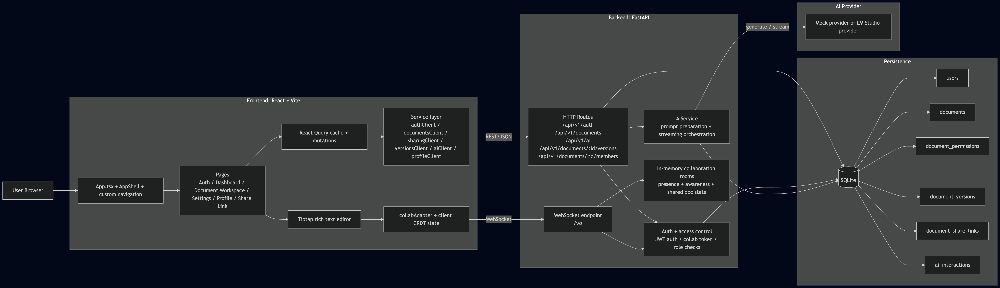
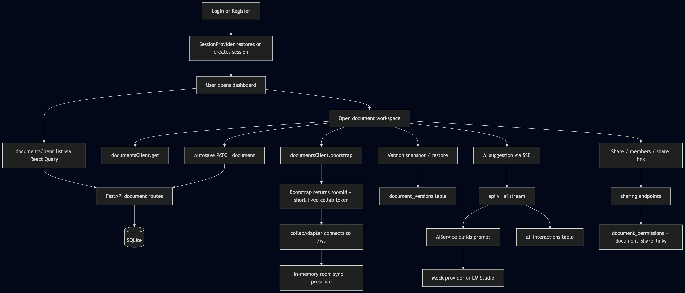
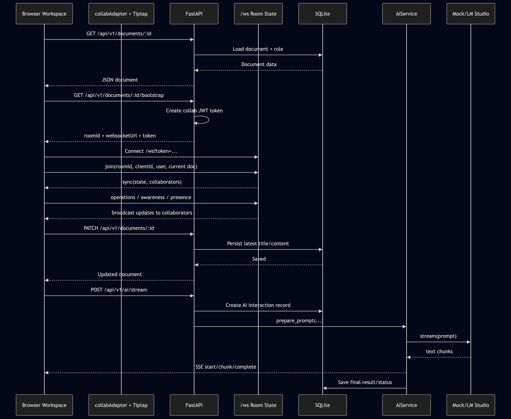

# Collaborative Document Editor

This repository contains:

- a FastAPI backend in `backend/`
- a React + Vite frontend in `frontend/`

The implementation now exposes the main document/auth flows under `/api/v1`, while keeping some legacy routes for compatibility.

## System Design


### High-Level Architecture



### Main Runtime Flow



### Collaboration and AI Sequence



## Prerequisites

Make sure these are installed:

- Python 3.10+
- Node.js 18+
- npm
- SQLite

## Setup

### Backend

The backend stores SQLite data in:

```text
backend/sqlite.db
```

Install backend dependencies:

```bash
cd backend
python3 -m venv .venv
source .venv/bin/activate
pip install -r requirements.txt
```

### Frontend

Install frontend dependencies:

```bash
cd frontend
npm install
```

### Environment

Create a root `.env` file before starting the apps:

```bash
cp .env.example .env
```

Important variables:

```bash
VITE_API_BASE_URL=http://127.0.0.1:8000
DATABASE_URL=sqlite:///./sqlite.db
JWT_SECRET_KEY=change-me-in-env
AI_PROVIDER=lmstudio
LM_STUDIO_BASE_URL=http://127.0.0.1:1234/v1
LM_STUDIO_MODEL=qwen2.5-3b-instruct
```

The frontend reads `VITE_API_BASE_URL` from the root `.env`.
The backend reads the same `.env` via `python-dotenv`.

## Run the App

### Option 1: Run both services automatically

From the repository root:

```bash
sh run-dev.sh
```

This starts:

- backend on `http://127.0.0.1:8000`
- frontend on `http://127.0.0.1:5173`

Press `Ctrl+C` to stop both.

### Option 2: Run manually in two terminals

Terminal 1:

```bash
cd backend
source .venv/bin/activate
uvicorn app.main:app --reload
```

Terminal 2:

```bash
cd frontend
npm run dev
```

Then open:

```text
http://localhost:5173
```

## Useful Endpoints

### Health

```bash
curl http://localhost:8000/health
```

### Main API namespace

The current frontend uses the `/api/v1` namespace for:

- auth: `/api/v1/auth/*`
- documents: `/api/v1/documents/*`
- sharing: `/api/v1/documents/{id}/members`
- bootstrap: `/api/v1/documents/{id}/bootstrap`
- versions: `/api/v1/documents/{id}/versions`
- AI: `/api/v1/ai/*`

## Testing

### Backend tests

Run all backend tests:

```bash
cd backend
source .venv/bin/activate
PYTHONPATH=. pytest
```

Run the core backend suites used for the recent changes:

```bash
cd backend
source .venv/bin/activate
PYTHONPATH=. pytest tests/test_documents.py tests/test_ai.py tests/test_websocket.py
```

### Frontend build check

```bash
cd frontend
npm run build
```

### Frontend tests

```bash
cd frontend
npm test
```

Single test file:

```bash
cd frontend
npm test -- --run src/features/editor/DocumentWorkspacePage.test.tsx
```

Watch mode:

```bash
cd frontend
npm run test:watch
```

### End-to-end tests

Install the Playwright browser once if needed:

```bash
cd frontend
npx playwright install chromium
```

Run the e2e suite:

```bash
cd frontend
npm run test:e2e
```

This automatically:

- starts the FastAPI backend on `http://127.0.0.1:8010`
- starts the Vite frontend on `http://127.0.0.1:4173`
- uses the mock AI provider for deterministic flows
- creates an isolated temporary SQLite database for the test run
- deletes that temporary database after the run finishes

Current e2e coverage includes:

- register and logout
- profile preference save flow
- document sharing and viewer read-only access
- login through AI suggestion acceptance

## Real-Time Collaboration

### Current implementation

Realtime collaboration is implemented with a backend WebSocket endpoint at `/ws`.

The current flow supports:

- multiple simultaneous clients
- document operation broadcast
- collaborator presence
- cursor/selection awareness

### Deliberate simplification

The assignment design describes a more separated and scalable realtime architecture.
This implementation keeps realtime inside the backend app for easier local testing and lower setup complexity.

That is acceptable for the current assignment-scale prototype, but it is documented as a remaining deviation in `DEVIATIONS.md`.
